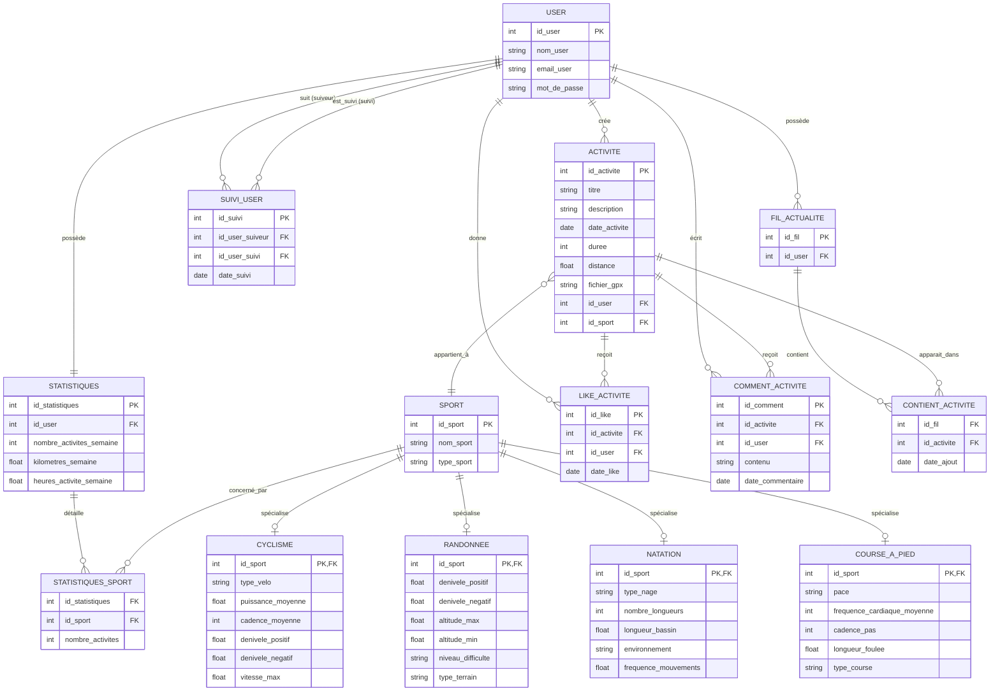

```mermaid
erDiagram
    %% Entités principales
    
    USER {
        int id_user PK
        string nom_user
        string email_user
        string mot_de_passe
    }
    
    ACTIVITE {
        int id_activite PK
        string titre
        string description
        date date_activite
        int duree
        float distance
        string fichier_gpx
        int id_user FK
        int id_sport FK
    }
    
    SPORT {
        int id_sport PK
        string nom_sport
        string type_sport
    }
    
    CYCLISME {
        int id_sport PK, FK
        string type_velo
        float puissance_moyenne
        int cadence_moyenne
        float denivele_positif
        float denivele_negatif
        float vitesse_max
    }
    
    RANDONNEE {
        int id_sport PK, FK
        float denivele_positif
        float denivele_negatif
        float altitude_max
        float altitude_min
        string niveau_difficulte
        string type_terrain
    }
    
    NATATION {
        int id_sport PK, FK
        string type_nage
        int nombre_longueurs
        float longueur_bassin
        string environnement
        float frequence_mouvements
    }
    
    COURSE_A_PIED {
        int id_sport PK, FK
        string pace
        int frequence_cardiaque_moyenne
        int cadence_pas
        float longueur_foulee
        string type_course
    }
    
    STATISTIQUES {
        int id_statistiques PK
        int id_user FK
        int nombre_activites_semaine
        float kilometres_semaine
        float heures_activite_semaine
    }
    
    LIKE_ACTIVITE {
        int id_like PK
        int id_activite FK
        int id_user FK
        date date_like
    }
    
    COMMENT_ACTIVITE {
        int id_comment PK
        int id_activite FK
        int id_user FK
        string contenu
        date date_commentaire
    }
    
    SUIVI_USER {
        int id_suivi PK
        int id_user_suiveur FK
        int id_user_suivi FK
        date date_suivi
    }
    
    FIL_ACTUALITE {
        int id_fil PK
        int id_user FK
    }
    
    CONTIENT_ACTIVITE {
        int id_fil FK
        int id_activite FK
        date date_ajout
    }
    
    STATISTIQUES_SPORT {
        int id_statistiques FK
        int id_sport FK
        int nombre_activites
    }

    %% Relations principales
    
    USER ||--o{ ACTIVITE : "crée"
    USER ||--|| STATISTIQUES : "possède"
    USER ||--o{ LIKE_ACTIVITE : "donne"
    USER ||--o{ COMMENT_ACTIVITE : "écrit"
    USER ||--o{ FIL_ACTUALITE : "possède"
    
    ACTIVITE }o--|| SPORT : "appartient_à"
    ACTIVITE ||--o{ LIKE_ACTIVITE : "reçoit"
    ACTIVITE ||--o{ COMMENT_ACTIVITE : "reçoit"
    
    %% Relations de suivi (auto-référence sur USER)
    USER ||--o{ SUIVI_USER : "suit (suiveur)"
    USER ||--o{ SUIVI_USER : "est_suivi (suivi)"
    
    %% Relations fil d'actualité
    FIL_ACTUALITE ||--o{ CONTIENT_ACTIVITE : "contient"
    ACTIVITE ||--o{ CONTIENT_ACTIVITE : "apparait_dans"
    
    %% Relations statistiques détaillées
    STATISTIQUES ||--o{ STATISTIQUES_SPORT : "détaille"
    SPORT ||--o{ STATISTIQUES_SPORT : "concerné_par"
    
    %% Héritage Sport (relations d'spécialisation)
    SPORT ||--o| CYCLISME : "spécialise"
    SPORT ||--o| RANDONNEE : "spécialise"
    SPORT ||--o| NATATION : "spécialise"
    SPORT ||--o| COURSE_A_PIED : "spécialise"

```
