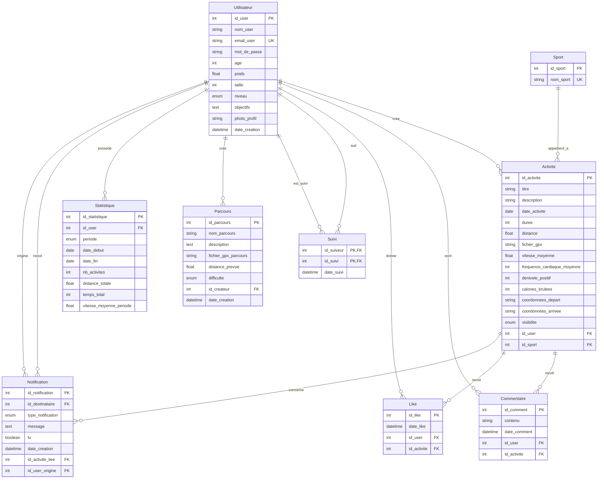

```mermaid
erDiagram
    Utilisateur {
        int id_user PK
        string nom_user
        string email_user UK
        string mot_de_passe
        int age
        float poids
        int taille
        enum niveau
        text objectifs
        string photo_profil
        datetime date_creation
    }
    
    Sport {
        int id_sport PK
        string nom_sport UK
    }
    
    Activite {
        int id_activite PK
        string titre
        string description
        date date_activite
        int duree
        float distance
        string fichier_gpx
        float vitesse_moyenne
        int frequence_cardiaque_moyenne
        int denivele_positif
        int calories_brulees
        string coordonnees_depart
        string coordonnees_arrivee
        enum visibilite
        int id_user FK
        int id_sport FK
    }
    
    Parcours {
        int id_parcours PK
        string nom_parcours
        text description
        string fichier_gpx_parcours
        float distance_prevue
        enum difficulte
        int id_createur FK
        datetime date_creation
    }
    
    Commentaire {
        int id_comment PK
        string contenu
        datetime date_comment
        int id_user FK
        int id_activite FK
    }
    
    Like {
        int id_like PK
        datetime date_like
        int id_user FK
        int id_activite FK
    }
    
    Suivi {
        int id_suiveur PK,FK
        int id_suivi PK,FK
        datetime date_suivi
    }
    
    Statistique {
        int id_statistique PK
        int id_user FK
        enum periode
        date date_debut
        date date_fin
        int nb_activites
        float distance_totale
        int temps_total
        float vitesse_moyenne_periode
    }
    
    Notification {
        int id_notification PK
        int id_destinataire FK
        enum type_notification
        text message
        boolean lu
        datetime date_creation
        int id_activite_liee FK
        int id_user_origine FK
    }

    %% Relations
    Utilisateur ||--o{ Activite : cree
    Sport ||--o{ Activite : appartient_a
    Activite ||--o{ Commentaire : recoit
    Activite ||--o{ Like : recoit
    Utilisateur ||--o{ Commentaire : ecrit
    Utilisateur ||--o{ Like : donne
    Utilisateur ||--o{ Suivi : suit
    Utilisateur ||--o{ Suivi : est_suivi
    Utilisateur ||--o{ Parcours : cree
    Utilisateur ||--o{ Statistique : possede
    Utilisateur ||--o{ Notification : recoit
    Utilisateur ||--o{ Notification : origine
    Activite ||--o{ Notification : concerne
```
