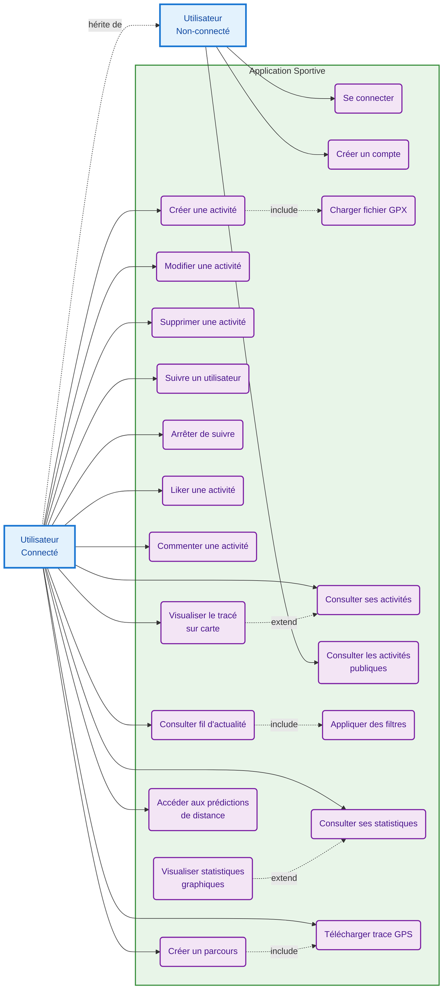

```mermaid

graph LR
    %% Acteurs
    UtilisateurNonConnecte[ Utilisateur<br/>Non-connecté]
    UtilisateurConnecte[ Utilisateur<br/>Connecté]

    %% Frontière du système
    subgraph AppSportive["Application Sportive"]
        
        %% Authentification
        SeConnecter(Se connecter)
        CreerCompte(Créer un compte)
        
        %% Gestion des activités
        CreerActivite(Créer une activité)
        ChargerFichierGPX(Charger fichier GPX)
        ConsulterActivites(Consulter ses activités)
        ModifierActivite(Modifier une activité)
        SupprimerActivite(Supprimer une activité)
        ConsulterActivitesPubliques(Consulter les activités<br/>publiques)
        
        %% Fonctionnalités sociales
        SuivreUtilisateur(Suivre un utilisateur)
        ArreterSuivre(Arrêter de suivre)
        LikerActivite(Liker une activité)
        CommenterActivite(Commenter une activité)
        ConsulterFilActualite(Consulter fil d'actualité)
        AppliquerFiltres(Appliquer des filtres)
        
        %% Statistiques et visualisation
        ConsulterStatistiques(Consulter ses statistiques)
        VisualiserTrace(Visualiser le tracé<br/>sur carte)
        VisualiserStatistiques(Visualiser statistiques<br/>graphiques)
        
        %% Fonctionnalités avancées
        CreerParcours(Créer un parcours)
        TelechargerTraceGPS(Télécharger trace GPS)
        PredictionsDistance(Accéder aux prédictions<br/>de distance)
        
       
    end

    %% Relations Utilisateur Non-connecté
    UtilisateurNonConnecte --> SeConnecter
    UtilisateurNonConnecte --> CreerCompte
    UtilisateurNonConnecte --> ConsulterActivitesPubliques

    %% Relations Utilisateur Connecté - Gestion activités
    UtilisateurConnecte --> CreerActivite
    UtilisateurConnecte --> ConsulterActivites
    UtilisateurConnecte --> ModifierActivite
    UtilisateurConnecte --> SupprimerActivite

    %% Relations Utilisateur Connecté - Social
    UtilisateurConnecte --> SuivreUtilisateur
    UtilisateurConnecte --> ArreterSuivre
    UtilisateurConnecte --> LikerActivite
    UtilisateurConnecte --> CommenterActivite
    UtilisateurConnecte --> ConsulterFilActualite

    %% Relations Utilisateur Connecté - Statistiques
    UtilisateurConnecte --> ConsulterStatistiques
    UtilisateurConnecte --> VisualiserTrace

    %% Relations Utilisateur Connecté - Fonctionnalités avancées
    UtilisateurConnecte --> CreerParcours
    UtilisateurConnecte --> TelechargerTraceGPS
    UtilisateurConnecte --> PredictionsDistance


    %% Relations d'inclusion (include)
    CreerActivite -.->|include| ChargerFichierGPX
    ConsulterFilActualite -.->|include| AppliquerFiltres
    CreerParcours -.->|include| TelechargerTraceGPS

    %% Relations d'extension (extend)
    VisualiserStatistiques -.->|extend| ConsulterStatistiques
    VisualiserTrace -.->|extend| ConsulterActivites

    %% Héritage d'acteur (généralisation)
    UtilisateurConnecte -.->|hérite de| UtilisateurNonConnecte

    %% Styles
    classDef actor fill:#e3f2fd,stroke:#1976d2,stroke-width:3px,color:#0d47a1
    classDef usecase fill:#f3e5f5,stroke:#7b1fa2,stroke-width:2px,color:#4a148c
    classDef system fill:#fff3e0,stroke:#f57c00,stroke-width:3px,color:#e65100
    classDef boundary fill:#e8f5e8,stroke:#388e3c,stroke-width:2px

    %% Application des styles
    class UtilisateurNonConnecte,UtilisateurConnecte actor
    class AppSportive boundary
    class SeConnecter,CreerCompte,CreerActivite,ChargerFichierGPX,ConsulterActivites,ModifierActivite,SupprimerActivite,ConsulterActivitesPubliques,SuivreUtilisateur,ArreterSuivre,LikerActivite,CommenterActivite,ConsulterFilActualite,AppliquerFiltres,ConsulterStatistiques,VisualiserTrace,VisualiserStatistiques,CreerParcours,TelechargerTraceGPS,PredictionsDistance,GererComptes,ModererContenu,ConsulterStatistiquesGlobales usecase
```
