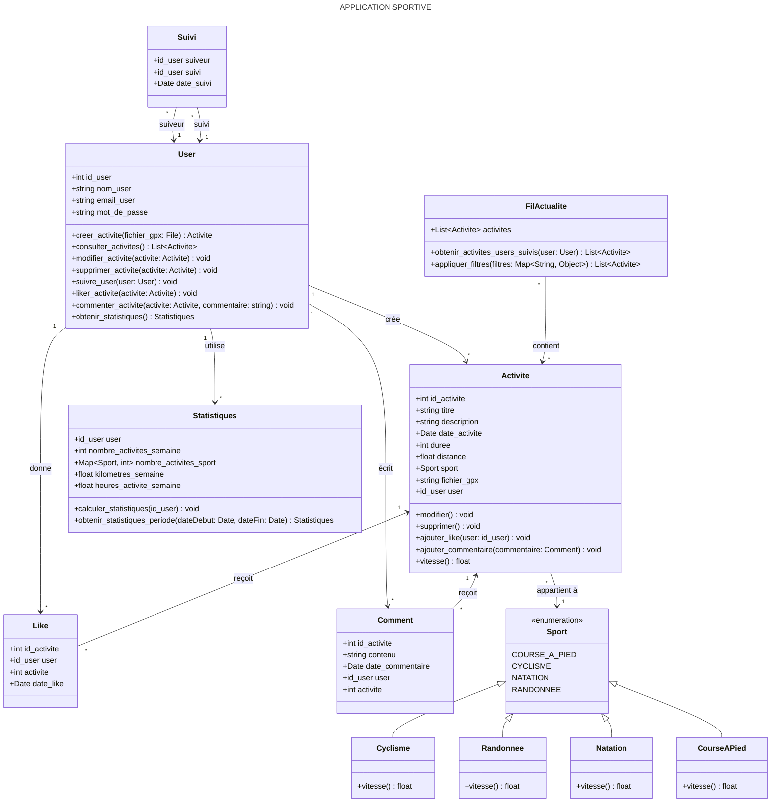

```mermaid
---
title: APPLICATION SPORTIVE
---

classDiagram
    class User {
        +int id_user
        +string nom_user
        +string email_user
        +string mot_de_passe
        +creer_activite(fichier_gpx: File) Activite
        +consulter_activites() List~Activite~
        +modifier_activite(activite: Activite) void
        +supprimer_activite(activite: Activite) void
        +suivre_user(user: User) void
        +liker_activite(activite: Activite) void
        +commenter_activite(activite: Activite, commentaire: string) void
        +obtenir_statistiques() Statistiques
    }

    class Suivi {
        +id_user suiveur
        +id_user suivi
        +Date date_suivi
    }

    class FilActualite {
        +List~Activite~ activites
        +obtenir_activites_users_suivis(user: User) List~Activite~
        +appliquer_filtres(filtres: Map~String, Object~) List~Activite~
    }

    class Activite {
        +int id_activite
        +string titre
        +string description
        +Date date_activite
        +int duree
        +float distance
        +Sport sport
        +string fichier_gpx
        +id_user user
        +modifier() void
        +supprimer() void
        +ajouter_like(user: id_user) void
        +ajouter_commentaire(commentaire: Comment) void
        +vitesse() float
    }

    class Statistiques {
        +id_user user
        +int nombre_activites_semaine
        +Map~Sport, int~ nombre_activites_sport
        +float kilometres_semaine
        +float heures_activite_semaine
        +calculer_statistiques(id_user) void
        +obtenir_statistiques_periode(dateDebut: Date, dateFin: Date) Statistiques
    }

    class Like {
        +int id_activite
        +id_user user
        +int activite
        +Date date_like
    }

    class Comment {
        +int id_activite
        +string contenu
        +Date date_commentaire
        +id_user user
        +int activite
    }

    class Sport {
        <<enumeration>>
        COURSE_A_PIED
        CYCLISME
        NATATION
        RANDONNEE
    }

    class Cyclisme {
        +vitesse() float
    }

    class Randonnee {
        +vitesse() float
    }

    class Natation {
        +vitesse() float
    }

    class CourseAPied {
        +vitesse() float
    }

    %% Relations
    User "1" --> "*" Activite : crée
    User "1" --> "*" Comment : écrit
    User "1" --> "*" Like : donne
    User "1" --> "*" Statistiques : utilise
    Activite "*" --> "1" Sport : appartient à
    Activite "1" <-- "*" Comment : reçoit
    Activite "1" <-- "*" Like : reçoit
    FilActualite "*" --> "*" Activite : contient
    Suivi "*" --> "1" User : suiveur
    Suivi "*" --> "1" User : suivi
    
    %% Héritage
    Sport <|-- Cyclisme
    Sport <|-- Randonnee
    Sport <|-- Natation
    Sport <|-- CourseAPied

```
